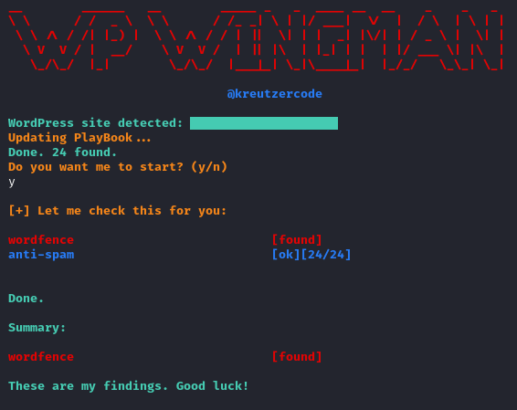

<div align="center">


</div>

<p align="center">
The WordPress Plugin Scanner designed for identifying any plugins on WordPress sites.
</p>

## Features

- Fetches up-to-date plugin slugs from the WordPress plugins API.
- Supports rate limiting to avoid excessive requests to the target site.
- Checks for the existence of each plugin on the target WordPress site.
- Possibility to save the plugin slugs collected via the Wordpress API in a file.
- Provides a summary and the option to save the results in a file.
- Supports the parallel execution of plugin slug checks.

## Functionality

The Purpose of this devensive Penetation testing tool to check every installed Plugin on a target system. It utilizes the WordPress Plugins API to fetch plugin slugs based on a specified tag. And runs it against the target system. The user can specify optional arguments to change the plugin search or plugin check procedure.

## Intentions

This script is intended for security testing. Any use should be approved by the owner of the target website. Use the rate limiting options if you are concerned about the server load caused.

## Install

### Download

1. **Navigate to the GitHub Repository:**
   Open your web browser and go to the GitHub repository where the program is hosted.

2. **Access the Actions Tab:**
   In the repository, click on the "Actions" tab. This tab is usually located near the top of the repository, next to "Code," "Issues," and "Pull requests."

3. **Select the Latest Workflow:**
   Inside the Actions tab, you'll see a list of workflows. Choose the workflow that corresponds to the build or release process of the program. GitHub Actions typically build and publish artifacts in specific workflows.

4. **View the Latest Run:**
   Click on the latest workflow run to view its details. You'll find a list of individual jobs and their statuses.

5. **Access the Artifacts:**
   Look for the "Artifacts" section in the workflow run details. GitHub Actions often produce artifacts, which are files generated during the workflow. There might be a link to download the artifacts directly.

6. **Download the Binary:**
   If there is a direct download link for the binary or artifact, click on it to download the latest program binary to your local machine.

We plab update the github action to add the build binaries to each release. At the moment there is only the inconviniet way.

### Linux

```yaml
$ cd /path/to/binary
$ chmod -R 777 wp-wingman
$ ./wp-wingman
```

## Usage

### Linux

```yaml
┌──(you㉿linux)-[~/Desktop]
└─$ ./wp-wingman
__        ______   __        _____ _   _  ____ __  __    _    _   _
\ \      / /  _ \  \ \      / /_ _| \ | |/ ___|  \/  |  / \  | \ | |
 \ \ /\ / /| |_) |  \ \ /\ / / | ||  \| | |  _| |\/| | / _ \ |  \| |
  \ V  V / |  __/    \ V  V /  | || |\  | |_| | |  | |/ ___ \| |\  |
   \_/\_/  |_|        \_/\_/  |___|_| \_|\____|_|  |_/_/   \_\_| \_|

                            @kreutzercode
Arguments:
        required: -u                    wordpress url
        optional: -t                    wordpress plugin tag (default securtiy)
        optional: -r                    rate limit on target (default 0-1s)
        optional: -w                    number of workers to execute playbook (only available in overdrive mode) (default 10)
        optional: --overdrive           executes playbook with the boys (very aggressiv)
        optional: --save-playbook       save collected plugins in file
        optional: --save-result         save plugins found on target in file

Send over Wingman:
./scan.sh -u www.example.com -r 5 -t newsletter

Happy scanning!
```

### Url

#### Argument: `-u`

With the -u argument you specify the url of the target system. Note that this is the only **required** argument.

**Examples:**

```
$ ./wp-wingman -u www.example.com

$ ./wp-wingman -u https://www.example.com
```

### Tag

#### Argument: `-t`

With the -t argument you can specify the target plugin group by searching for a specific tag like _security_, _newsletter_ etc.  
If you want to fetch all public plugins, you can add the all argument `-t all`. Be in mind that this takes a while.

**Tip**: use in combination with `--save-playbook` to skip waiting time in the next run

### Rate limit

#### Argument: `-r`

**Important**: This argument is only available in normal mode (not in overdrive mode)

With the -r argument, you can specify the number of seconds to wait before the next plugin slug is checked on the target system.

### Workers

#### Argument: `-w`

**Important**: This argument is only valid in combination the `--overdrive` flag

With the -w argument, you can specify the number of workers that process the playbook in parallel.

- Min Value: 2
- Min Value: 100

### Overdrive

#### Argument: `--overdrive`

**Important**: This mode is very aggressiv

In overdrive mode, the wingman gathers his boys to work on the playbook in parallel. Please note that this can place an additional load on your and the target system.

**Tip**: use in combination with `-w` to specify number of workers

### Save Playbook

#### Argument: `--save-playbook`

With the `--save-playbook` argument, the plugin slugs collected from the wordpress api are saved to a `wp-wingman-x.txt` file.

The script automatically determines whether a save file exists for the current mode or tag and asks whether it should be used.

### Save Result

#### Argument: `--save-result`

With the argument `--save-result` the found plugins are saved in a file `wp-wingman-x-x.txt` after a successful operation.

## Example output



# TODO

- add custom error messages for invalud / missing arguments
- add ramdon user agent argument
